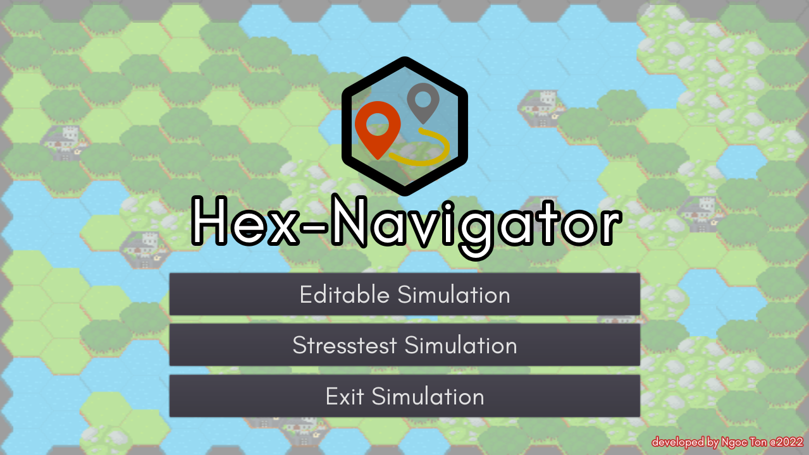

# Hex Navigator

## Summary:
A short demonstration of hexagon grid-based pathfinding with up to three agents.
Includes a mode with editable map and a mode for compile stresstests.

The hexagon tileset was taken from here: https://cuddlyclover.itch.io/fantasy-hex-tiles

The creation of this game was subject of the AI in Games project 2022 at the Ulm University, Germany.

## Playable at itch.io:
[Check it out <3](https://locher.itch.io/hexnavigator)
